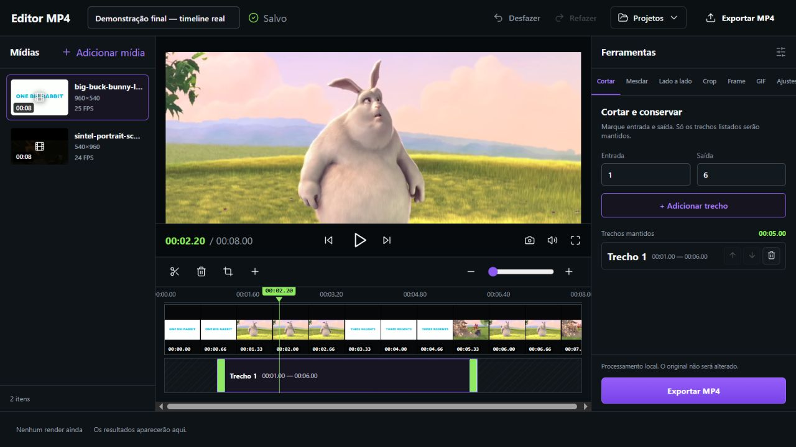
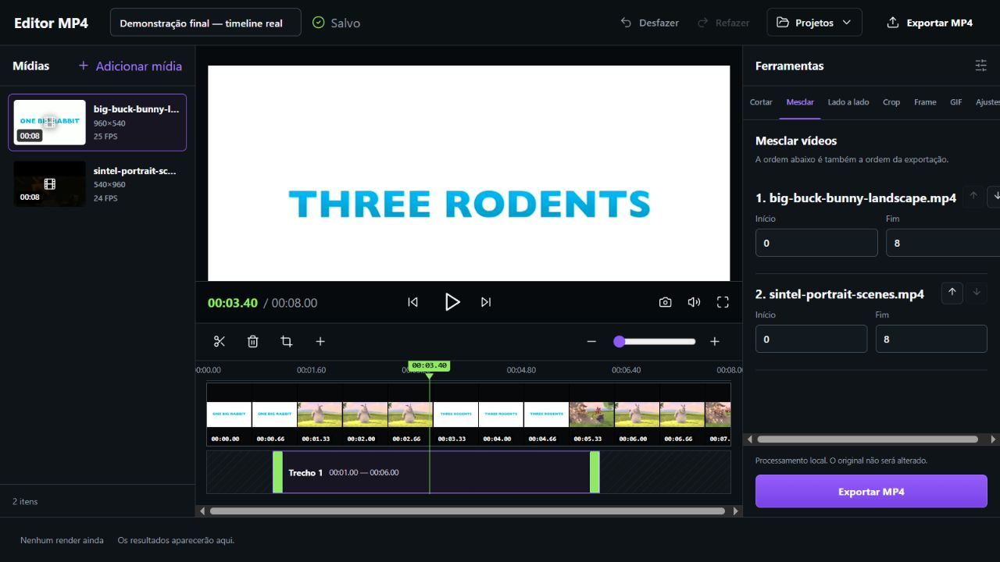
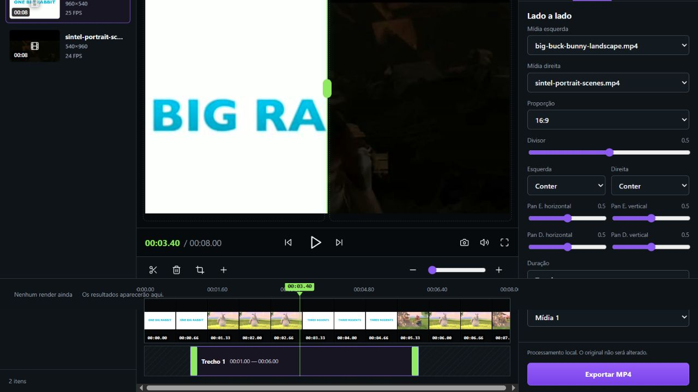
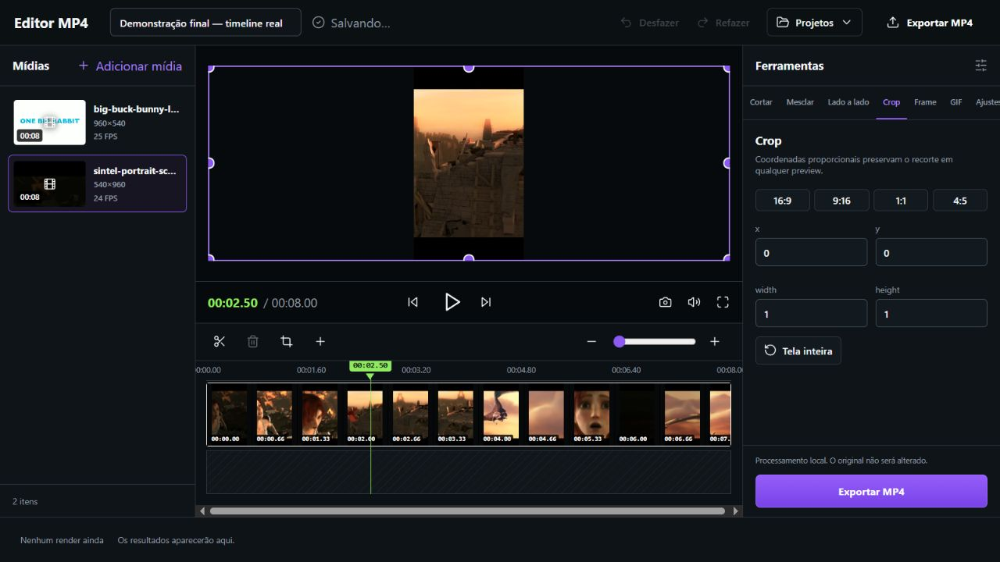
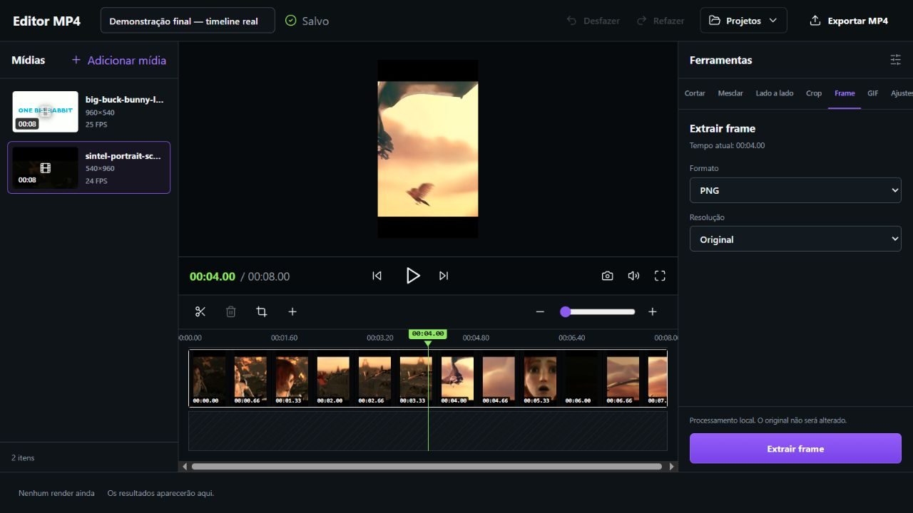
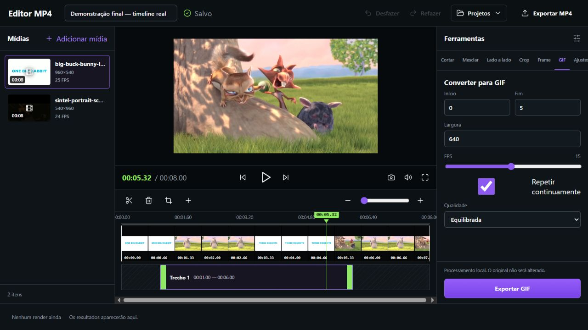
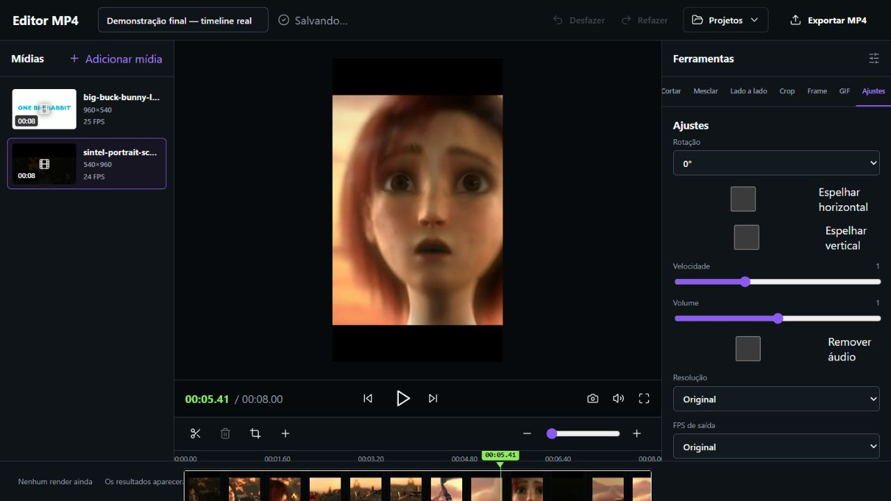
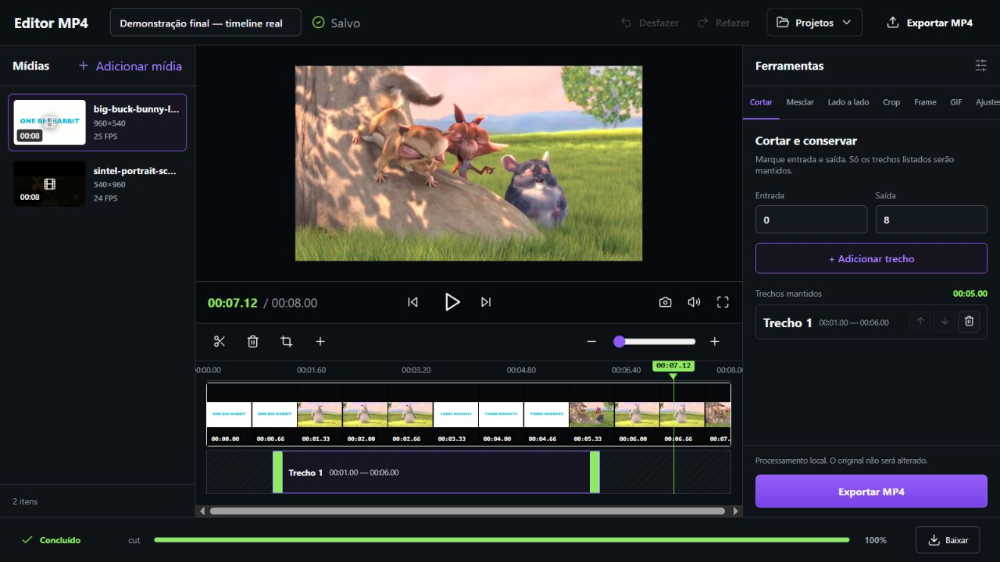
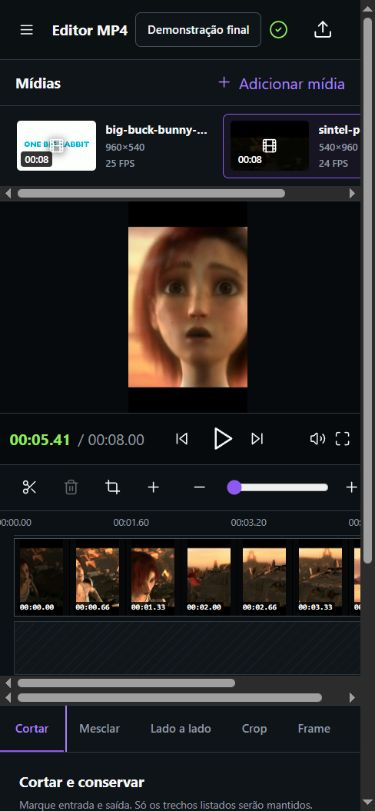

# MP4 Studio

Editor de vídeo local e orientado a projetos. A interface é feita em React, os projetos são persistidos em SQLite e todo processamento de mídia acontece localmente pelo FFmpeg.


## Principais recursos

- biblioteca de mídias com importação múltipla e arrastar/soltar;
- suporte a MP4, WebP animado, WebP estático, PNG e JPEG;
- preview, transporte, seek e timeline com quadros reais de vários timeframes;
- thumbs completas na proporção original: retrato continua retrato e paisagem continua paisagem;
- playhead, zoom, clips, aparadores, crop e divisor lado a lado manipuláveis diretamente;
- corte por múltiplos trechos, com remoção e reordenação;
- mesclagem de vídeos com ordem e intervalos independentes;
- composição lado a lado com proporção, divisor, contain/cover, pan, duração e política de áudio;
- crop proporcional com presets 16:9, 9:16, 1:1 e 4:5;
- rotação, espelhamento, velocidade, volume, mute, resolução, FPS e qualidade;
- frame em PNG, JPEG ou WebP;
- GIF animado com intervalo, largura, FPS e loop;
- fila de render com progresso, cancelamento e download;
- desfazer/refazer com histórico de 50 edições;
- salvamento automático e restauração pelo SQLite;
- interface desktop completa; adaptação mobile está planejada no roadmap.

## Galeria de recursos

Cada imagem abaixo foi capturada no aplicativo em execução com MP4s reais. Não há poster repetido para simular a timeline: a QA gerou 12 JPEGs temporais por vídeo e confirmou 12 hashes SHA-256 distintos tanto no clipe 960×540 quanto no clipe 540×960. Os MP4s, recortes, banco e renders de demonstração não fazem parte do repositório.

| Corte e timeline | Mesclar vídeos |
| --- | --- |
|  |  |

| Lado a lado | Crop vertical |
| --- | --- |
|  |  |

| Extrair frame | Converter para GIF |
| --- | --- |
|  |  |

| Ajustes de saída | Render concluído |
| --- | --- |
|  |  |

## Requisitos

- Windows 10 ou 11;
- Node.js 24 ou superior;
- FFmpeg e ffprobe.

Por padrão, o MP4 Studio procura os executáveis em:

```text
D:\AI\ffmpeg-shared\ffmpeg-master-latest-win64-gpl-shared\bin
```

Quando essa instalação não existe, o aplicativo tenta usar `ffmpeg` e `ffprobe` disponíveis no `PATH` do sistema.

## Instalação

```powershell
git clone https://github.com/GuttoSP/MP4-Studio.git D:\projetos\editor_mp4
cd D:\projetos\editor_mp4
npm install
npm run build
```

## Uso no Windows

1. Dê dois cliques em `iniciar-editor.vbs`.
2. Aguarde alguns segundos.
3. Abra [http://127.0.0.1:43171](http://127.0.0.1:43171).
4. Para encerrar o servidor, execute `parar-editor.vbs`.

Os atalhos iniciam e encerram o servidor sem deixar uma janela de terminal aberta.

Também é possível executar pelo PowerShell:

```powershell
cd D:\projetos\editor_mp4
npm start
```

## Fluxo básico

1. Crie um projeto.
2. Importe um ou mais arquivos na coluna **Mídias**.
3. Selecione uma operação em **Ferramentas**.
4. Ajuste a timeline, intervalos e parâmetros de saída.
5. Clique em **Exportar MP4**, **Extrair frame** ou **Exportar GIF**.
6. Acompanhe o progresso e use **Baixar** quando terminar.

Os arquivos originais nunca são alterados. O aplicativo trabalha com cópias armazenadas no diretório local de dados.

## Interface móvel

A versão mobile está em desenvolvimento. Monitor, biblioteca horizontal, timeline rolável e inspetor já se reorganizam em 390 × 844, mas a validação ainda encontra overflow horizontal no documento (507 px para uma viewport de 390 px). O ajuste final está registrado na [issue #4](https://github.com/GuttoSP/MP4-Studio/issues/4); até ela ser fechada, o desktop é a experiência recomendada.



## Mídias da galeria

| Mídia | Uso na galeria | Fonte pública |
| --- | --- | --- |
| Big Buck Bunny | paisagem 960×540; corte, mesclagem, lado a lado, GIF e render | [trailer MP4 hospedado pelo W3C](https://media.w3.org/2010/05/bunny/trailer.mp4) e [projeto no Blender Studio](https://studio.blender.org/projects/big-buck-bunny/) |
| Sintel | recorte retrato 540×960; crop, frame, ajustes e mobile | [trailer MP4 hospedado pelo W3C](https://media.w3.org/2010/05/sintel/trailer.mp4) e [projeto no Blender Studio](https://studio.blender.org/projects/sintel/) |

- **Créditos e licença:** filmes e imagens © Blender Foundation, disponibilizados sob [Creative Commons Attribution 3.0](https://creativecommons.org/licenses/by/3.0/).
- **Uso neste repositório:** somente os pixels visíveis nos screenshots são versionados. Os arquivos MP4, recortes de QA, JPEGs temporais, banco SQLite e renders permanecem fora do Git.

## Persistência local

O conteúdo do usuário fica somente na máquina local e não é rastreado pelo Git:

```text
data/editor-mp4.sqlite3                    banco SQLite
data/projects/<projeto>/assets             cópias das mídias importadas
data/projects/<projeto>/thumbnails         poster e filmstrips temporais por mídia
data/projects/<projeto>/renders            arquivos exportados
```

Além de `data/`, o `.gitignore` exclui logs, resultados de testes, builds e arquivos temporários comuns de editores.

## Desenvolvimento

```powershell
npm run dev
npm test
npm run test:integration
npm run build
```

- frontend de desenvolvimento: `http://127.0.0.1:43170`;
- API e build de produção: `http://127.0.0.1:43171`.

Os testes de integração geram suas próprias mídias sintéticas e validam corte, mesclagem, lado a lado, frame e GIF usando FFmpeg real.

## Privacidade e segurança

- nenhuma mídia é enviada para serviços externos;
- caminhos fornecidos pelo cliente são resolvidos dentro da pasta controlada pelo projeto;
- os comandos FFmpeg são executados sem shell;
- arquivos, banco, logs e renders locais permanecem ignorados pelo Git;
- futuras contribuições automatizadas devem limitar commits a arquivos explicitamente produzidos para a alteração e nunca inspecionar ou publicar conteúdo local do usuário.

## Problemas e sugestões

Use as [Issues do GitHub](https://github.com/GuttoSP/MP4-Studio/issues) para registrar erros reproduzíveis ou propostas de melhoria. Inclua os passos para reproduzir, o resultado esperado e o resultado observado. Não anexe vídeos privados, bancos SQLite, logs pessoais nem conteúdo de projetos reais.

## Licença

Consulte o arquivo [LICENSE](LICENSE).
